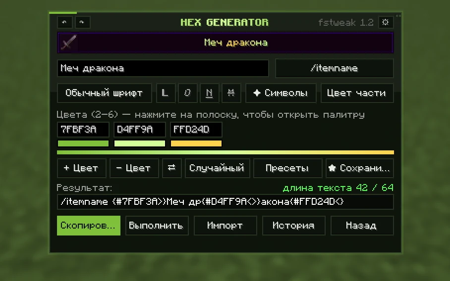
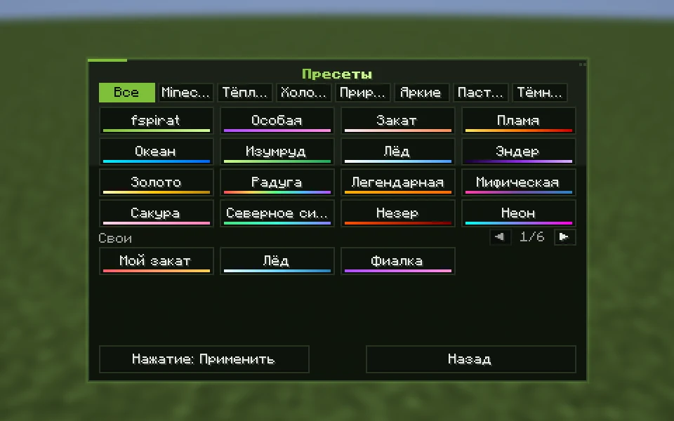
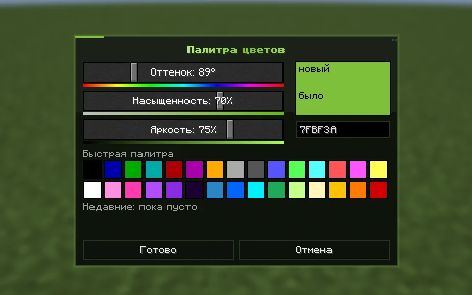
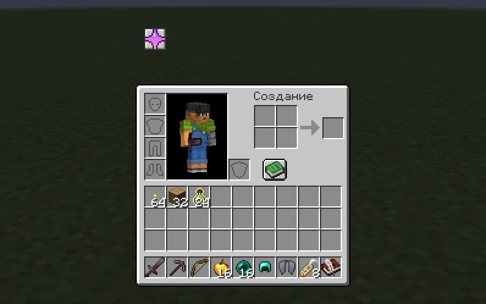
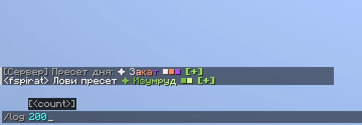
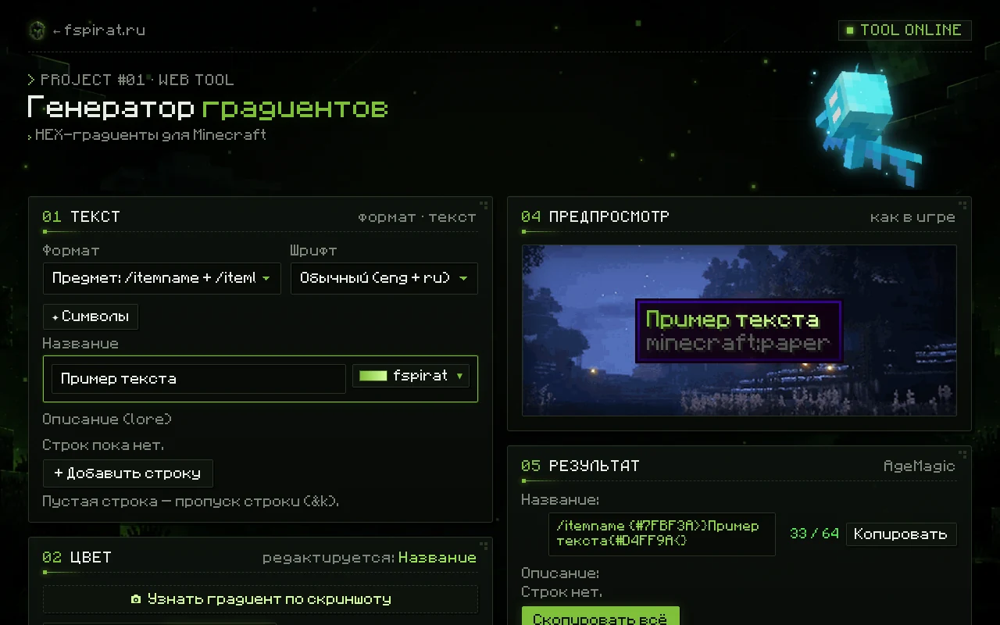

#  FSTWEAK — HEX-градиенты и логгер чата для Minecraft


**FSTWEAK** — клиентский Fabric-мод: генератор HEX-градиентов для названий предметов, ников и префиксов прямо в игре и команда `/log`, которая сохраняет чат и даёт на него ссылку.

В этом репозитории также лежат отдельный мод **FSLOG** (только логгер чата) и сайт [fspirat.ru](https://fspirat.ru): веб-версия генератора, страница мода, просмотр чат-логов и админ-панель со статистикой.

<p align="center">
  
</p>

## Скачать

Актуальная версия — **1.2.2**. Нужен файл под вашу версию Minecraft:

| Minecraft | Файл | Java |
|---|---|---|
| 26.2 | [fstweak-26.2.jar](https://fspirat.ru/api/dl.php?f=fstweak-26.2.jar) | 25+ |
| 26.1.2 | [fstweak-26.1.2.jar](https://fspirat.ru/api/dl.php?f=fstweak-26.1.2.jar) | 25+ |
| 1.21.11 | [fstweak-1.21.11.jar](https://fspirat.ru/api/dl.php?f=fstweak-1.21.11.jar) | 21+ |

Страница мода с описанием и скриншотами: **[fspirat.ru/fstweak](https://fspirat.ru/fstweak/)**. Предыдущие версии — в [Releases](https://github.com/fspirat/project_hex/releases).

## Установка

1. Установите [Fabric Loader](https://fabricmc.net/use/installer/) **0.18.0 или новее** для своей версии Minecraft.
2. Скачайте [Fabric API](https://modrinth.com/mod/fabric-api) для той же версии.
3. Положите `fabric-api-….jar` и `fstweak-….jar` в папку `.minecraft/mods`.
4. Запустите игру с профилем Fabric.

Мод работает только на клиенте — ставить его на сервер не нужно.

## Возможности

### 🎨 HEX GENERATOR

- ✅ Градиент из 2–6 цветов с предпросмотром «как в игре», палитра с оттенком, насыщенностью и яркостью
- ✅ 87 готовых палитр в 8 категориях и до 12 своих пресетов: сохранить, переименовать, переставить, удалить
- ✅ Жирный, курсив, подчёркнутый и зачёркнутый текст, свой цвет или градиент для выделенной части текста
- ✅ 12 Unicode-шрифтов (меняют только латиницу) и 19 вкладок символов с избранным и недавними
- ✅ Форматы вывода: `/itemname`, `/itemlore`, `/sponsor prefix`, `/sponsor editprefix`, `&#rrggbb`, `<#rrggbb>`, `&x&r&r…`, `§x§r§r…`, BBCode, MiniMessage, свой шаблон BirdFlop
- ✅ Режим классических цветов `/colors` (`&a`, `&c`…) для игроков без HEX
- ✅ «Скопировать» или «Выполнить» команду одной кнопкой, счётчик длины относительно лимита
- ✅ Импорт готовой команды из буфера обмена и названия предмета из руки вместе с цветами
- ✅ История последних 10 команд, отмена и повтор (`Ctrl+Z` / `Ctrl+Y`)
- ✅ Обмен пресетами через чат: короткий код превращается в кнопку `[+]`, которая сохраняет пресет
- ✅ 4 темы окна, анимация градиента в предпросмотре, перевод на русский, английский и украинский

### 💬 Логгер чата `/log`

- ✅ Запоминает до 5000 последних сообщений чата вместе с цветами, временем и сервером
- ✅ По команде загружает их на fspirat.online и присылает в чат ссылку для браузера
- ✅ На странице лога — фильтр «Все / Игроки / Система», копирование и скачивание `.txt`

<p align="center">
  
  
</p>

## Использование

Генератор открывается клавишей **H** (меняется в *Настройки → Управление → Разное*) или кнопкой над инвентарём. Кнопку можно перетащить с зажатым `Ctrl`, а вернуть на место — в настройках мода.

<p align="center">
  
</p>

Команды логгера:

```text
/log          — сохранить весь накопленный чат и получить ссылку
/log 200      — сохранить только последние 200 сообщений
/log clear    — очистить накопленный чат
/chatlog      — то же, что /log
```

<p align="center">
  
</p>

> [!NOTE]
> Открыть лог может любой, у кого есть ссылка, а также администратор сайта. Лог удаляется через 30 дней, если администратор его не закрепил. Между загрузками нужно подождать 15 секунд; сервер принимает не больше 6 логов за 10 минут и 40 за сутки с одного адреса.

## Какие данные отправляет мод

Мод обращается только к `fspirat.online` — других сетевых запросов в коде нет. Всё отправленное видит администратор сайта в админ-панели.

| Когда | Что отправляется | Что видит администратор и сколько хранится |
|---|---|---|
| При входе в мир и раз в 10 минут | ник, версия мода и Minecraft, адрес сервера (или `singleplayer`), язык игры, счётчики нажатий кнопок мода (без текста, цветов и команд) | список игроков с модом: ник, версии, сервер, язык, первый и последний вход, число заходов и история «на каком сервере с какой версией». Удаления по сроку нет. Счётчики кнопок — только общие, без привязки к нику, 90 дней |
| Только по команде `/log` | сообщения чата, время, сервер и ник | список всех логов (ник, сервер, число сообщений, просмотры) и сами логи. Администратор может открыть, удалить или закрепить лог. Обычный лог удаляется через 30 дней, закреплённый хранится, пока его не удалят |

IP-адреса игроков в базу не записываются — сервер хранит только их хэш, чтобы ограничивать частоту запросов. Отдельной настройки, отключающей отправку данных, в моде сейчас нет.

## FSLOG — отдельный логгер чата

`fslog-*` — тот же логгер `/log`, но без генератора, для тех, кому нужен только он. FSTWEAK уже содержит FSLOG внутри; если установлены оба мода, работает отдельный FSLOG, а встроенный не включается. Готовые файлы FSLOG собираются в CI как артефакты, в релизы FSTWEAK они не попадают.

## Сайт fspirat.ru

Папка `sites/fspirat.ru` — статические страницы и PHP-бэкенд с базой SQLite.

| Путь | Что там |
|---|---|
| `/` | главная страница: соцсети и проекты |
| `/hex_generator/` | веб-версия генератора градиентов, в том числе «градиент по скриншоту» |
| `/fstweak/` | страница мода со скриншотами и кнопками скачивания |
| `/log/?id=…` | просмотр сохранённого чат-лога |
| `/admin/` | админ-панель (только на fspirat.online): посетители, игроки с модом, скачивания, чат-логи, состояние сервера |
| `/api/` | счётчик посещений, проверка версии мода, приём логов, скачивание файлов со счётчиком |

Счётчик посещений записывает страницы, источник перехода, тип устройства, браузер и систему без IP-адресов и хранит их 90 дней.

<p align="center">
  
</p>

<details>
<summary><b>Развёртывание сайта</b></summary>

Нужны веб-сервер с PHP **8.1+** и модулем SQLite (`php-sqlite3`). База и настройки хранятся вне папки сайта, в `/var/lib/fspirat-stats` (путь меняется переменной `FSPIRAT_STATS_DIR`).

Первая настройка и пароль админки — только из консоли сервера:

```bash
sudo -u www-data php /var/www/fspirat.online/api/lib/setup.php
```

Выкладку делает workflow **Deploy site** (rsync по SSH при пуше в `main`); ключ и адрес сервера берутся из секретов репозитория.

</details>

## Сборка из исходников

Нужны **JDK 25** и **Gradle** (в CI — 9.2.1 для 1.21.11 и 9.5.1 для 26.x; Gradle Wrapper в репозитории нет).

```bash
cd hexgen-26.2        # или hexgen-26.1.2, hexgen-1.21.11, fslog-*
gradle build
```

Готовый файл появится в `build/libs/`.

### Как устроен код

| Папка | Назначение |
|---|---|
| `hexgen-1.21.11` | основной исходный код FSTWEAK — правки вносятся только здесь |
| `hexgen-26.1.2`, `hexgen-26.2` | копии под Minecraft 26.x, генерируются скриптом `./sync-versions.sh` |
| `fslog-1.21.11` | исходный код FSLOG; `./sync-fslog.sh` переносит его в `fslog-26.*` и внутрь FSTWEAK |
| `sites/fspirat.ru` | сайт и API |
| `.github/workflows` | сборка, релизы, выкладка сайта и файлов, скриншоты |

<details>
<summary><b>GitHub Actions</b></summary>

| Workflow | Что делает |
|---|---|
| **Build mod** | собирает все 6 модулей при каждом пуше; с тегом `v*` создаёт релиз и выкладывает файлы на сайт |
| **Publish downloads** | загружает jar-файлы из релиза на сервер для скачивания с fspirat.ru |
| **Deploy site** | выкладывает `sites/fspirat.ru` на сервер |
| **Mod screenshots** | запускает Minecraft с модом в виртуальном экране (Fabric client gametest) и снимает окна мода |
| **Deploy fspirat.online (GitHub Pages)** | публикует копию сайта на GitHub Pages |

</details>

## Лицензия

В метаданных мода (`fabric.mod.json`) указана лицензия **MIT**. Отдельного файла `LICENSE` в репозитории пока нет.
